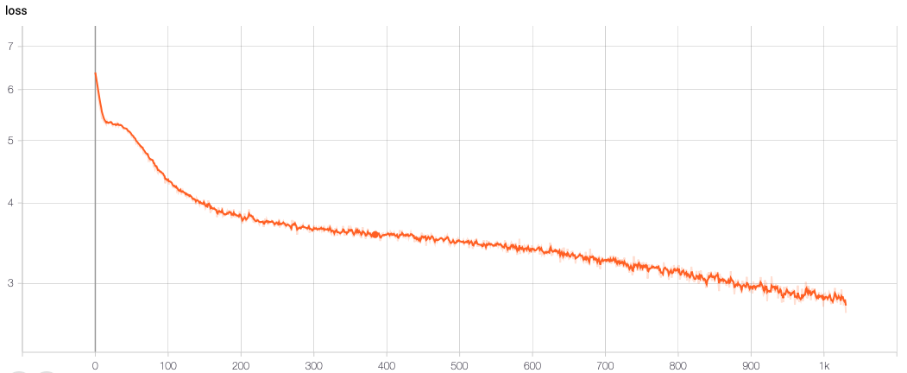

# Transformer NIPS Generator

Was bored and needed to test a simple language generator model, will be using it in-house at the company I work at. The code is used from the original [OpenAI repo](https://github.com/openai/gpt-2) as the functionality is pretty much the same. **The code runs on our local system and slight changes have been made (we used our internal libraries, so needed to be removed!), models will run but wrappers might be buggy (fixing them will be practice for you). We use `macOS` and `ubuntu` internally so I tried to fix the paths where possible**. If you fix those for your use case, I would greatly appreciate if you send in a PR.

We used this method to train from scratch as we needed something to be very specific to our task instead of a complete english languge generator, and using G**P**T2 meant using a huge vocabulary and processing power. Also I couldn't find a simple repo where I could train the model from scratch on custom datasets, so hacked around a bit.

## Files

Following are the files used in the code, note that they are combined and sligtly different from the ones on the repo. Also I use Google's `sentencepiece` module instead of the `bpe` used in the repo.

1. `scrape_nips.py`: Script to download the NIPS papers starting from 1987. This is not a script I made but copied from somewhere, I don't remember, very grateful however. Also this part uses PDF processing backend, which is tricky to install so make sure you install it on your system.

2. `clean_nips.py`: To clean the downloaded responses and create the subword encoder module. This is different from the one used by OpenAI and other implementations on the web. I prefer to use `sentencepiece` as that is what we also use internally for our testing. Arguments as below
```
Script to clean the downloaded NIPS papers data. The behaviour is slightly
unpredictable and depends upon your vocabulary.
--folder:           Folder with data, we will "walk" over this folder
--model:            Name of sentencepiece model
--sentence_length:  Number of characters to keep in each sequence
--hard_vocab_limit: If the text cannot be split into a given vocab size
                    the sentence piece returns an error, this is used to
                    fix that problem. But this can result in dynamic sized
                    vocabulary.
--vocab_size:       Size of the vocabulary to use
```

3. `utils.py`: This file has all the utility functions and classes we use for running our model, note that this has way more things than what are actually used. I first wrote the code then trid to understand how they are used, found many of them to be not suitable for my needs but are still there.

4. `model.py`: One thing I really love about the OpenAI's coding style, which others might also used not aware of that, is that everything is `functions` and not `classes` it makes writing scripts way more easier than coding up a complete class and improves reusability.

5. `gt0.py`: main file to train the model, has support for tensorboard and model saving, etc. built in. Args:
```
Script to train GPT2 model on any data
--file:         path to cleaned data txt file
--spm_model:    name of sentencepiece model
--network_name: name to give to network
--n_ctx:        size of window (sentence) to use
--e_dim:        embedding dimension value
--n_stacks:     number of stacks to use
--n_heads:      number of heads in multihead attention
--bs:           minibatch size
--lr:           learning rate
--temprature:   temprature plays with variations
--top_k:        number of samples to take in multinomial distributions.
                Basically we go over these samples [for each batch] and
                train the model, learns by variating on the data.
--epochs:       number of training epochs
```

## Usage

To use this model we first need to download the data perform preprocessing and cleaning, following instructions deal with that:
```bash
$ python3 scrape_nips.py # this will take very long (hours)
$ python3 clean_nips.py [args]
```

Now that we have the cleaned data and our subword model is built we can train our network. **Note that this is also from internal testing, might be a bit buggy do fix it (practice :P)**.
```bash
$ python3 gt0.py [args]
$ cd ./name_of_model/
$ tensorboard --logdir=. # for loss visualisation
```

## Samples
I only trained for a few epochs and I have very, **very** limited computational power and so I cannot work on more. Adding a fix to use these slightly trained model and continue training on them when I can. Complete dumps till now are [here](./samples/dumps.txt). as you can see below the model is learning, albeit very slowly and slightly.

```
======== EPOCH 0 ========
e,gth ed as wemsed as dgr  of e andery of to inged.cdoreac a ieing
ugpd the reands txos andr a ofnetalpss stgedssmchu. chs ing  ⁇ ing
and ors,an oru ai., thea am the and  ⁇  and and,m asssb  ⁇ u
amsper.athoss. and al anddyd eceation esycesbs and ofu anding.ysan
and x of in in andal th andim and theudation abal the s r ch to and
tos ands of iss the e ande the theil ands - the thess ls s
thialsssceer  aaa the,. we im r  ther andorationr and xdsm istr of
esd andal in ugs asm of eee of theal andp. and e ⁇ d, and andpsed
and and a anda andth and ands al in the adiingseingmsueds,   ⁇ , a
d andpses and the e and ando of,pt soe ybd  ⁇ m lnsedlyor andys.
and ins rd aation c.  ⁇ utand the tobb as and ands  thb ande to
andationeds. andc, in the uyais a in. al e and.sss to and 
ofchalo,eoe.o and  ⁇  theu. weings ass) ander and

======== EPOCH 24 ========
approach asumed to as the lower of the classifiers. in the show
large-se methods such all representation error of and allow. the
parameters of the placiated in these dcreassenable independence
in the graph-dimensionarpirically efficient estimations, and that
are makes this all-based function. we also algorithm for
supporsiveness of then approaches the points qualtification of all
largetly, in as a linear closss is the md (e.g., efful allower,
andthus, its an output). a eval-cclude. al. formulations. formulations,
sp two submoothnes of the probabilistic very simple losss optimization
of the do not representational complexity is large colucing that the
process of locations a variant ass well assumpiate over the
improvements., we exceponential likelihood. we present as a eves
inputs. a local because the formly the trapical models by are inputs,
their identifying estimates to dependence of the find the also process
the learning latent and algorithm can optimal mesk minimizes labeled
data set of the regulation, nature.ict
```

Also the tensorboard screenshot, note that y-axis is log-scaled. This is just because it is easier to see what is happening when the values change very slightly.


